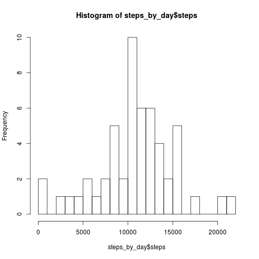
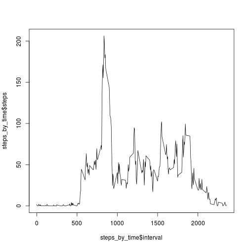
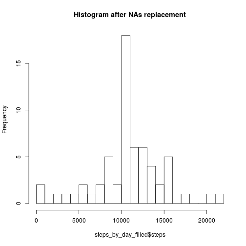
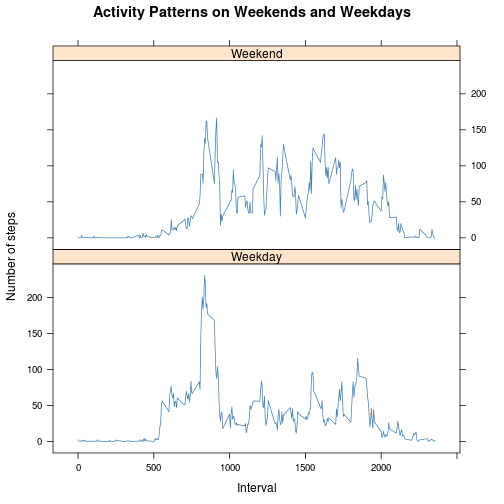

Before start exploring our data we have to include all required packages with the following command:

```r
library(lattice)
```

Then we read and take a very first look at the file structure:

```r
data <- read.csv(file = "activity.csv")
head(data)
```

```
##   steps       date interval
## 1    NA 2012-10-01        0
## 2    NA 2012-10-01        5
## 3    NA 2012-10-01       10
## 4    NA 2012-10-01       15
## 5    NA 2012-10-01       20
## 6    NA 2012-10-01       25
```

```r
str(data)
```

```
## 'data.frame':	17568 obs. of  3 variables:
##  $ steps   : int  NA NA NA NA NA NA NA NA NA NA ...
##  $ date    : Factor w/ 61 levels "2012-10-01","2012-10-02",..: 1 1 1 1 1 1 1 1 1 1 ...
##  $ interval: int  0 5 10 15 20 25 30 35 40 45 ...
```

Let's calculate and examine total number of steps taken per each day:

```r
steps_by_day <- aggregate(steps ~ date, data = data, FUN = sum)
hist(steps_by_day$steps,breaks = 20)
```

 

The mean and median values of the total number of steps taken per day:

```r
mean(steps_by_day$steps)
```

```
## [1] 10766.19
```

```r
median(steps_by_day$steps)
```

```
## [1] 10765
```

Let's now examine mean number of steps taken by each 5-minute interval:

```r
steps_by_time <- aggregate(steps ~ interval, data = data, FUN = mean)
plot(x = steps_by_time$interval, 
     y = steps_by_time$steps, 
     type ='l')
```

 

```r
max_steps_arg = which.max(steps_by_time$steps)
max_steps_time <- steps_by_time$interval[max_steps_arg]
max_steps_time
```

```
## [1] 835
```
We can see the highest activity at 8:35 AM

In the data we've explored we have a lot of missing values. Let's count them and replace it with the mean values within each time interval (you can uncomment the string to controll replacing process).

```r
summary(data$steps)["NA's"]
```

```
## NA's 
## 2304
```

```r
data_tidy <- data
for (iter in 1:nrow(data_tidy))
    {
    if (is.na(data_tidy$steps[iter]))
        {
        time_interval <- data_tidy$interval[iter]
        mean_for_time <- steps_by_time[steps_by_time$interval==time_interval,"steps"]
        data_tidy$steps[iter] <- mean_for_time
        #cat(iter,time_interval,mean_for_time,'\n', sep=' ### ')
        } 
    }
summary(data_tidy$steps)
```

```
##    Min. 1st Qu.  Median    Mean 3rd Qu.    Max. 
##    0.00    0.00    0.00   37.38   27.00  806.00
```

As we can see there is no NA's in the new dataset called **data_tidy**.
Let's check how our replacement affects data statistics:

```r
steps_by_day_filled <- aggregate(steps ~ date, data = data_tidy, FUN = sum)
hist(steps_by_day_filled$steps,breaks = 20,main = 'Histogram after NAs replacement')
```

 

```r
mean(steps_by_day_filled$steps)
```

```
## [1] 10766.19
```

```r
median(steps_by_day_filled$steps)
```

```
## [1] 10766.19
```

To explore how weekday impact on human activity we want to mark weekends in our dataset:

```r
data_tidy$weekday <- weekdays(as.Date(data_tidy$date))
data_tidy$weekends <- ifelse(data_tidy$weekday == "Суббота" | 
                             data_tidy$weekday == "Воскресенье", "Weekend", "Weekday")
```

Finally we calculate mean number of steps for each time interval separately for weekends and workdays:

```r
steps_by_time_weekend_flag <- aggregate(data_tidy$steps, 
                                        by = list(data_tidy$interval, data_tidy$weekends),
                                        FUN=mean)
colnames(steps_by_time_weekend_flag) <- c("interval", "weekend_flag", "steps")
xyplot(steps ~ interval | weekend_flag, 
       steps_by_time_weekend_flag, 
       type = "l", 
       layout = c(1,2), 
       xlab = "Interval", 
       ylab = "Number of steps", 
       main = "Activity Patterns on Weekends and Weekdays", 
       col = "steelblue")
```

 
